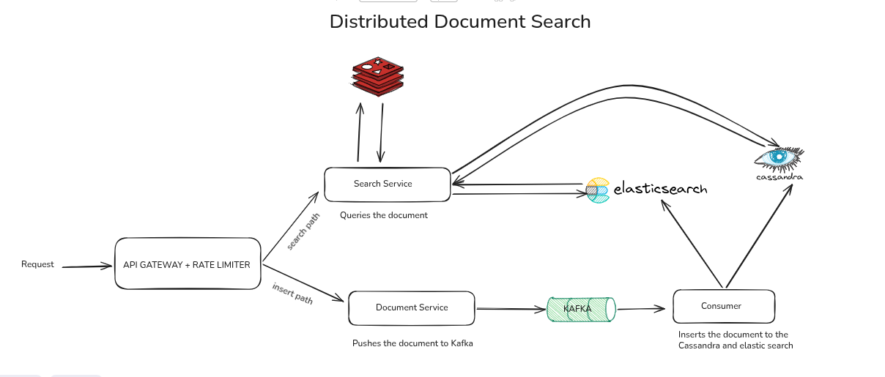
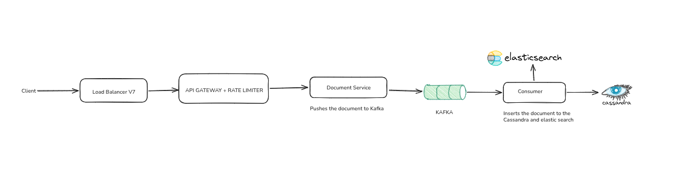
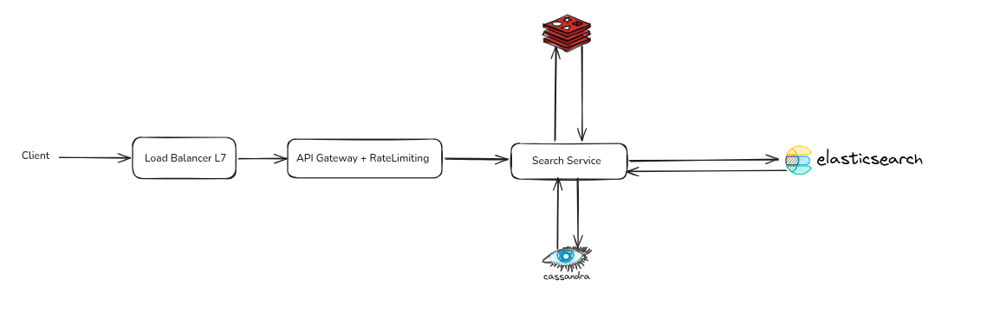

# Distributed Document Search Service
## Whole Architecture


### Data Model Of Documents



```go 
type Document struct {
    TenantID   string    `json:"tenantId"`
    DocumentID uuid.UUID `json:"documentId"`
    Version    int64     `json:"version"`
    Title      string    `json:"title"`
    Content    string    `json:"content"`
    Author     string    `json:"author"`
    Tags       []string  `json:"tags"`
    CreatedAt  time.Time `json:"createdAt"`
    UpdatedAt  time.Time `json:"updatedAt"`
}
```

#### Document Entity
A Document represents a unit of content that belongs to a tenant and is searchable.

Fields:

- TenantID (string): Identifier for the tenant. Used for isolation and all queries are scoped to this field.
- DocumentID (UUID): Globally unique identifier for the document.
- Version (int64): Incremented on every update. Used to handle out-of-order events in Kafka and ensure eventual consistency correctness.
- Title (string): Document title used for full-text search with higher relevance weighting.
- Content (string): Main body of the document used for full-text search.
- Author (string): Metadata field representing document author.
- Tags ([]string): List of tags for filtering and categorization.
- CreatedAt (timestamp): Creation time of the document.
- UpdatedAt (timestamp): Last modification time of the document.


## Why a seperate read and write path

- Independent scaling: Write operations and read operations (Elasticsearch) can be scaled separately based on demand.
- Performance isolation:  high write throughput does not slow down reads.
- Fault isolation: Failures or degradation in the search layer do not block writes, and vice versa.
- Maintainability: Each path can evolve independently, making the system easier to extend, debug, and scale.


## Write Path



### Load Balancing Strategy

We use a load balancer. It also integrates well with API Gateway features like authentication, rate limiting, and logging.

### API Gateway

An API Gateway serves as the single entry point for all client requests, handling request routing, authentication, authorization, logging, and other cross-cutting concerns. It also provides a centralized place to enforce multi-tenant policies by identifying requests using the X-Tenant-ID header. In the future, this enables tenant-specific routing, quotas, and other customized policies without requiring changes to the backend services.

### Rate Limiting (Token Bucket)

To protect the system from traffic spikes and ensure fair resource utilization, the API Gateway implements a Token Bucket rate limiting algorithm. Each tenant is assigned a token bucket that refills at a fixed rate while allowing a configurable burst of requests. Every incoming request consumes a token, and requests are throttled once the bucket is empty until tokens are replenished. This approach accommodates short bursts of traffic while preventing downstream services such as Cassandra, Kafka, and Elasticsearch from being overwhelmed.

> In a production deployment, the Token Bucket state would be stored in Redis to synchronize rate limits across multiple API Gateway instances, ensuring consistent enforcement regardless of which instance serves the request. For this a distributed rate limiter is beyond the scope of the implementation so did not included the details.

### Documents Service

The Document Service is responsible for validating requests, enforcing tenant isolation, performing data transformations, and publishing document events to Kafka. It supports multiple document formats, such as PDF and CSV, extracting and transforming their contents into a common document model before indexing, uploaded documents are subject to a configurable maximum file size.

The service returns a success response once the document has been successfully accepted and published to Kafka, while indexing is performed asynchronously by downstream consumers. In high-load scenarios, multiple instances of the Document Service can be deployed behind the load balancer to scale horizontally, with Kafka providing buffering and workload distribution.

### Kafka 

### Kafka Partitioning Strategy

Kafka messages are serialized using **Protocol Buffers (Protobuf)** to reduce message size and improve serialization performance compared to JSON. The `documents` topic is configured with **16 partitions** and uses **`documentId`** as the message key. This provides an even distribution of events across partitions, enabling multiple consumers within a consumer group to process documents in parallel and improving write throughput.

The trade-off is that documents belonging to the same tenant may be processed by different consumers, as ordering is only guaranteed within a partition. Using `tenantId` as the message key would preserve ordering and consumer affinity for each tenant but could lead to uneven partition utilization if some tenants generate significantly more traffic. Since this system prioritizes scalability and balanced workload distribution, `documentId` is chosen as the message key.

### Document Consumer

The Document Consumer consumes document events from Kafka and performs dual writes to **Cassandra** and **Elasticsearch**. Processing is asynchronous, allowing the write API to respond quickly while persistence and indexing occur in the background.

For each event, the consumer deserializes the Protobuf message and compares the incoming `Version` with the stored version. If a newer version already exists, the older event is discarded to prevent stale updates. Otherwise, the document is written to **Cassandra** (the source of truth), indexed into **Elasticsearch**, and any cached entries associated with the document are invalidated to ensure subsequent reads return the latest version.

If either write fails, the consumer retries the operation before acknowledging the Kafka message. The service can be scaled horizontally by adding more consumer instances, with Kafka automatically distributing partitions across the consumer group. In a production environment, dedicated consumer instances or consumer groups can also be allocated to high-volume tenants, preventing them from impacting the performance of other tenants while allowing independent scaling based on tenant workload.

### Cassandra 

Cassandra Data Model

Cassandra is used as the primary system of record for storing documents. The schema is designed for high write throughput, predictable access patterns, and horizontal scalability in a multi-tenant system.

Table Schema
```sql 
CREATE TABLE documents (
    tenant_id text,
    bucket_id int,
    document_id uuid,

    version bigint,
    title text,
    content text,
    author text,
    tags list<text>,

    created_at timestamp,
    updated_at timestamp,

    PRIMARY KEY ((tenant_id, bucket_id), document_id)
);
```

Partitioning Strategy

The partition key is a composite key (tenant_id, bucket_id), where bucket_id is used to distribute a single tenant’s data across multiple partitions. The document_id acts as the clustering key.

The bucket_id is derived using:

> hash(document_id) % N for uniform distribution ,this prevents hot partitions for high-traffic tenants and ensures even distribution across the cluster.

- Cassandra is optimized for fast, sequential writes and can handle continuous ingestion from Kafka without bottlenecks caused by joins, transactions, or heavy indexing overhead.

- Horizontal Scalability

- Cassandra uses a shared-nothing architecture with consistent hashing, allowing the system to scale linearly by adding nodes. This makes it suitable for growing multi-tenant workloads without redesigning the schema.

- Fit for Event-Driven Architecture
    Cassandra acts as the source of truth, while Elasticsearch is a derived index used only for search. This ensures durability even if downstream systems fail, as the index can always be rebuilt from Cassandra or Kafka events.

- Cassandra requires data modeling around access patterns rather than normalized relations. This trade-off is acceptable because:
Queries are predictable (tenant + document access)
Elasticsearch handles all search and filtering complexity
No joins or relational queries are required


## Elasticsearch

### Elasticsearch Data Model

Elasticsearch is used as a derived search index for supporting full-text search over documents. It is not the source of truth; documents are indexed asynchronously from Cassandra via Kafka consumers.

```json 
Index Mapping
{
  "mappings": {
    "properties": {
      "tenantId": {
        "type": "keyword"
      },
      "documentId": {
        "type": "keyword"
      },
      "version": {
        "type": "long"
      },
      "title": {
        "type": "text",
        "analyzer": "english"
      },
      "content": {
        "type": "text",
        "analyzer": "english"
      },
      "author": {
        "type": "keyword"
      },
      "tags": {
        "type": "keyword"
      },
      "createdAt": {
        "type": "date"
      },
      "updatedAt": {
        "type": "date"
      }
    }
  }
} 
```

Field Design
keyword fields (tenantId, documentId, author, tags): used for filtering and exact matching
text fields (title, content): used for full-text search
> english analyzer: improves relevance using stemming and stop-word removal
version field: ensures stale Kafka events do not overwrite newer documents

tenantId filtering: enforces strict multi-tenant isolation

1. Elasticsearch is purpose-built for search using inverted indexes. It provides:

- Relevance scoring (BM25)
- Tokenization and stemming
- Fuzzy and partial matching
- Field boosting (e.g., title > content)

These features are difficult and inefficient to implement in relational or document databases.

2. High Concurrency Search Load
The system expects multiple tenants performing searches simultaneously. Elasticsearch handles:
High query concurrency
Distributed query execution
Independent scaling of search cluster

This ensures search traffic does not impact the ingestion or storage systems.

3. Decoupling from Primary Database

Elasticsearch acts as a secondary index, while Cassandra is the source of truth. This separation ensures:

Write-heavy ingestion does not slow down search
Search load does not affect primary storage
Each system can scale independently
4. Horizontal Scalability

Elasticsearch scales naturally using:

Sharding
Replication
Distributed query execution

This makes it suitable for large-scale document search workloads.

5. Near Real-Time Indexing

Elasticsearch supports near real-time indexing, making newly ingested documents searchable within seconds through the Kafka-based pipeline.

### Alternatives Considered
PostgreSQL Full-Text Search

PostgreSQL FTS was considered but not chosen because:

Write-heavy ingestion would overload index maintenance
Search performance degrades at large scale
High concurrency search can create bottlenecks
Scaling requires read replicas or complex sharding
MongoDB Full-Text Search


## Read Path



### Search Service

The Search Service is responsible for searching the document store (Elasticsearch) and serving all read requests. It acts as the dedicated read-side component of the system, abstracting the underlying search engine from clients while enforcing tenant isolation and search-specific business logic.

When a search request is received, the service first authenticates and authorizes the request through the API Gateway. It validates the search parameters, extracts the tenant identity, and constructs an optimized Elasticsearch query scoped to that tenant. Before querying Elasticsearch, the service checks Redis using the Cache-Aside pattern. If a cached response exists, it is returned immediately. Otherwise, the service queries Elasticsearch, caches the results with a configurable TTL, and returns them to the client.

During both indexing and searching, Elasticsearch uses the configured **English analyzer** to normalize text. The analyzer tokenizes the document into individual terms, removes common stop words such as *"the"*, *"is"*, and *"and"*, and applies stemming to reduce words to their root form (for example, *"running"*, *"runs"*, and *"ran"* are normalized to *"run"*). Because the same analysis pipeline is applied when documents are indexed and when queries are executed, users can find relevant documents even if different grammatical forms of a word are used.

The Search Service is responsible for:

- Searching the Elasticsearch document store using full-text search.
- Enforcing strict multi-tenant isolation by filtering every query using `tenantId`.
- Constructing optimized Elasticsearch DSL queries.
- Leveraging Elasticsearch analyzers for tokenization, stop-word removal, and stemming.
- Applying relevance ranking (BM25), pagination, and sorting.
- Supporting metadata filtering such as author, tags, and date ranges.
- Caching frequently executed queries in Redis to reduce Elasticsearch load and improve response times.
- Transforming Elasticsearch responses into a simplified API response for clients.


### Redis Caching Strategy

The Search Service uses **Redis** as a distributed cache to reduce search latency and minimize queries to Elasticsearch. It implements the **Cache-Aside** pattern, where each search request first checks Redis using a cache key composed of the `tenantId` and search parameters. On a cache hit, the cached response is returned immediately; on a cache miss, the service queries Elasticsearch, stores the serialized search results in Redis with a configurable **TTL** (e.g., 5 minutes), and returns the response.Redis is chosen because its in-memory architecture provides sub-millisecond access times, supports distributed caching across multiple Search Service instances, and significantly reduces the load on Elasticsearch for frequently executed queries.

> we could also invalidate old version of cache in document consumer but we would like to make sure ttl is handling it and key has a version

If the dataset size and traffic were small, we could have used simpler solutions like PostgreSQL Full-Text Search or Redis Search (RediSearch) instead of a distributed architecture. PostgreSQL FTS would be sufficient for moderate-scale systems because it supports indexing, ranking, and filtering within a single system, reducing architectural complexity. Similarly, Redis Search could handle low-latency search for small datasets entirely in-memory.

However, these solutions do not scale well for our requirements of 10M+ documents and 1000+ QPS with multi-tenancy and sub-second latency guarantees. PostgreSQL becomes constrained due to index maintenance overhead and vertical scaling limits, while Redis Search is memory-bound and becomes expensive and inefficient at large data sizes. In contrast, our current design using Elasticsearch for distributed search + Cassandra for durable storage + Kafka for async indexing provides horizontal scalability, fault tolerance, and independent scaling of read and write workloads, making it suitable for large-scale production systems.

## Fault Tolerance

One of the primary reasons for introducing **Kafka** into the architecture is to improve fault tolerance by decoupling the write API from downstream storage systems.

When a document is submitted, the Document Service validates the request and publishes the event to Kafka. Once Kafka acknowledges that the event has been durably persisted, the client receives a successful response. The document is then processed asynchronously by the Document Consumer.

This design allows the system to continue accepting write requests even if **Cassandra**, **Elasticsearch**, or both become temporarily unavailable. Since Kafka durably stores the events, consumers simply stop making progress while the downstream systems are unavailable. Once the failed service recovers, the consumers resume processing from their last committed offsets and continue persisting documents to Cassandra and indexing them into Elasticsearch.

This approach provides several benefits:

* **Write availability:** Client write requests continue to succeed as long as Kafka remains available, even during Cassandra or Elasticsearch outages.
* **Durable buffering:** Kafka acts as a persistent buffer, preventing data loss during temporary downstream failures.
* **Automatic recovery:** Consumers replay queued events after recovery, ensuring eventual consistency between Kafka, Cassandra, and Elasticsearch.
* **Failure isolation:** Storage or indexing failures do not directly impact the write API, preventing cascading failures across the system.
* **Traffic smoothing:** During traffic spikes, Kafka absorbs bursts of incoming writes while consumers process events at a sustainable rate.

The trade-off is that the system becomes **eventually consistent**. Newly accepted documents may not appear in search results immediately because indexing is performed asynchronously. However, this is an acceptable trade-off for achieving high write availability, resilience, and independent scaling of the write and read paths.


### Data Reading Statergy 

We use a **hybrid read model using both Elasticsearch and Cassandra**. Elasticsearch is used for **fast full-text search and ranking**, and it returns matching `documentId`s based on relevance. The Search Service then fetches the **full, authoritative document data from Cassandra**, which is the source of truth and always holds the latest version of the document. This approach balances **low-latency search performance from Elasticsearch** with **strong consistency and correctness from Cassandra**, ensuring that users get accurate and up-to-date document content in responses.
we will use ttl with random time to avoid thudering herd or even request coleasing would work

## Production Readiness Analysis
### Scalability

To handle 100x growth in documents and traffic, the system is designed for horizontal scaling at every layer. The API Gateway and Search Service can scale horizontally behind a load balancer, while Kafka partitions ensure high-throughput event ingestion. Cassandra scales linearly by adding nodes and using partitioning (tenantId + bucketId) to distribute load evenly. Elasticsearch can be scaled via sharding and replication to handle increased indexing and query load. Redis can be scaled using clustering and partitioned caching of search queries. For extreme scale, hot tenants can be isolated using dedicated consumer groups and index partitions.

### Resilience

The system uses Kafka as a buffer to decouple write and read paths, ensuring no data loss during spikes or partial failures.If Elasticsearch is unavailable, the system can degrade gracefully by serving limited or cached results. Cassandra replication ensures data availability across nodes and availability zones.

### Security

Authentication is handled via JWT tokens validated at the API Gateway. Authorization is enforced using tenant-based access control (X-Tenant-ID), ensuring strict multi-tenant isolation. All service-to-service communication is secured using TLS encryption, and sensitive data is encrypted at rest in Cassandra and Elasticsearch. Rate limiting per tenant prevents abuse and ensures fair resource usage. API security is further enforced through input validation and request throttling.

Observability

The system will centralized logging, metrics, and distributed tracing. Structured logs include tenantId, documentId, and requestId for traceability. Metrics such as Kafka lag, Elasticsearch query latency, Cassandra read/write latency, cache hit ratio, and API P95/P99 latency are collected using Prometheus. Distributed tracing (e.g., OpenTelemetry) is used to track requests across API Gateway → Search Service → Elasticsearch/Cassandra. Alerts are configured for SLA violations and system degradation.

Performance

Elasticsearch is optimized using proper index mappings, field boosting, and sharding strategies to support fast full-text search. Cassandra uses efficient partitioning (tenantId + bucketId) to avoid hot partitions and ensure uniform load distribution. Redis caching reduces repeated query load on Elasticsearch. Pagination and result limiting prevent large response payloads. Kafka batching improves throughput for indexing operations. Query optimization includes filtering before scoring and avoiding expensive wildcard queries.

Operations

The system is deployed using containerized services (Docker/Kubernetes) with rolling or blue-green deployments to ensure zero downtime. Kafka consumers are deployed independently to allow controlled scaling. Cassandra supports incremental backups and point-in-time recovery using snapshots. Elasticsearch indices are versioned to allow safe reindexing without downtime. CI/CD pipelines ensure automated testing, deployment, and rollback capabilities.


SLA Considerations (99.95% availability)

To achieve 99.95% availability, the system is designed with redundancy at every layer. Services are deployed across multiple availability zones with load balancing and health checks. Kafka ensures durability and replayability of events during failures. Cassandra replication factor ensures data availability even during node failures. Elasticsearch clusters are configured with replicas to handle node outages.


### A similar distributed system you've built and its scale/impac

I designed a real-time pricing architecture for a sportsbook system that handled around 2 million concurrent markets. The system needed to continuously update odds based on live events while ensuring low latency and high availability across multiple regions. We used an event-driven architecture where price updates were streamed through Kafka and processed by multiple stateless services responsible for market calculations.

### Critical Production Incident (HPA + Consumer Offset Issue)

We had a production incident where a sudden traffic spike triggered HPA scaling, and multiple consumer instances started processing the same workload incorrectly. The root cause was that consumers were reading offsets from a shared database instead of relying on Kafka’s native offset management. When scaling occurred, offset synchronization broke, leading to duplicate processing and inconsistent state updates. We resolved this by moving offset management fully to Kafka consumer groups and removing database-based offset tracking. Additionally, we implemented idempotent processing using version checks to ensure duplicate events would not corrupt state. After the fix, we also added monitoring on consumer lag and rebalance events to detect similar issues early.

### Architectural Decision (Balancing Competing Concerns)

In one of our system design decisions, we had to choose between storing multiple odds formats in PostgreSQL versus computing them on the fly using Redis-based caching and computation. Initially, storing precomputed odds in the database seemed simpler, but it introduced significant challenges: it would have increased PostgreSQL storage size rapidly, added write amplification, and also increased Kafka message payload size, which was already hitting system limits due to high-frequency market updates.

We instead chose a design where we store only the base odds in the database and use Redis to compute and serve derived odds formats on demand. This reduced database bloat, kept Kafka messages lightweight, and improved flexibility because new odds formats could be introduced without schema changes or database migrations. Redis also allowed us to cache computed results for frequently accessed markets, reducing recomputation overhead while maintaining low latency.

This decision balanced storage efficiency, system scalability, and future extensibility, at the cost of slightly higher compute logic in the read path, which was mitigated using caching.